# WordMasterProject
## Ver 1.0
### 단어 추가 및 모든 단어 보기, 나가기 기능을 추가하였습니다.
* 단어 추가 기능

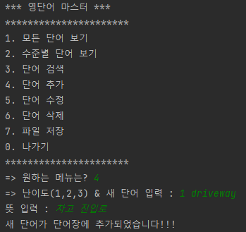
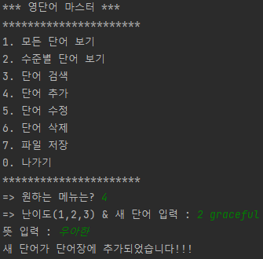
* 모든 단어 보기 기능

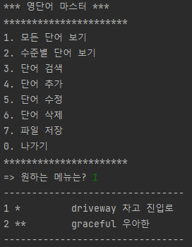
* 나가기 기능

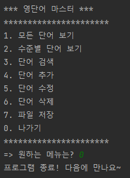
* * *
## Ver 1.1
### 수준별 단어보기, 단어 검색, 단어 수정, 단어 삭제, 파일 불러오기 및 저장 기능을 추가하였습니다.

* 파일 불러오기 기능

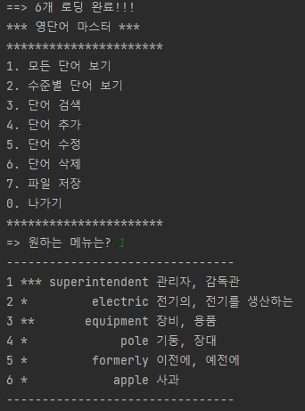
* 수준별 단어보기 기능

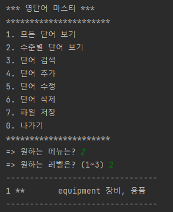
* 단어 검색 기능

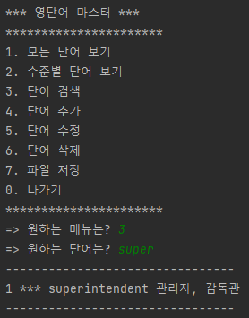
* 단어 수정

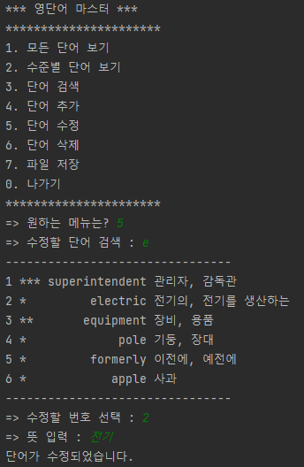
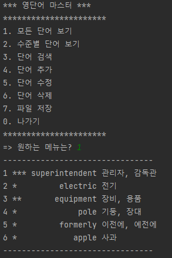
* 단어 삭제 기능

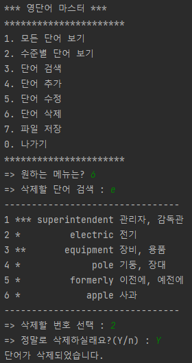
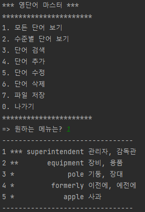
* 파일 저장 기능

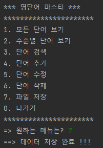
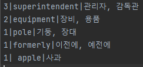